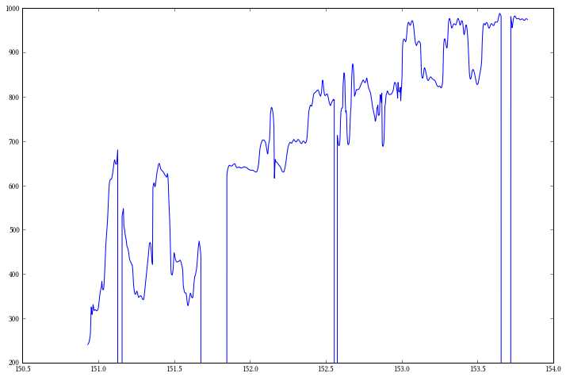
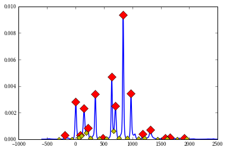

Intonation python module
------------------------

Homepage:
`https://github.com/gopalkoduri/intonation <https://github.com/gopalkoduri/intonation>`_

The intonation python module has broadly four classes:

-  **Intervals**: defines an object which has a set of intervals, of
   course! It has basic functions that facilitate the easy access to
   these intervals.
-  **Histogram**: defines a histogram object with methods used to find
   peaks using different methods and plot them.
-  *\* Pitch*\ \*: Given timestamps in seconds, and pitch values in
   cents, it defines a pitch object which has a number of methods which
   can be used to study the intervals
-  **Recording**: Given a pitch object, it defines a recording object
   which has methods to computer histogram, intonation profile and label
   sections of pitch contours with given set of intervals.

.. code:: python

    %pylab inline
    pylab.rcParams['figure.figsize'] = 12, 8
    
    import intonation
    print dir(intonation)

.. parsed-literal::

    Populating the interactive namespace from numpy and matplotlib
    ['Histogram', 'Intervals', 'Pitch', 'Recording', '__builtins__', '__doc__', '__file__', '__name__', '__package__', '__path__', 'pitch', 'recording', 'utils']

Load some data
--------------

A sample file with pitch data, and another file with just-intonation
intervals are included. The pitch in the file given is in cents scale,
normalized to tonic. If you don't have this, you should get it from
`https://github.com/gopalkoduri/intonation <https://github.com/gopalkoduri/intonation>`_,
or load your own data.

Make sure the data is formatted as a numpy array of mx2 size where m is
number of total points. The first column should corresponds to time
stamps in seconds and the second column should correspond to the pitch
value in cents. The given file is already formatted this way!

.. code:: python

    import pickle
    data = loadtxt("88d8196a-123a-4306-9856-4ce3faca14fc.txt")
    intervals = pickle.load(file("ji-intervals.pickle"))
Have a look at the data, it always does good!
---------------------------------------------

.. code:: python

    plot(data[52000:53000, 0], data[52000:53000, 1])
    ylim(200, 1000)

.. parsed-literal::

    (200, 1000)

Load the data into a pitch object
---------------------------------

You can avail a number of different method on pitch object to study
different aspects of intervals. Let's also look at what methods are
available and what they do.

.. code:: python

    pitch_obj = intonation.Pitch(data[:, 0], data[:, 1])
    help(pitch_obj)

.. parsed-literal::

    Help on instance of Pitch in module intonation.pitch:
    
    class Pitch
     |  Methods defined here:
     |  
     |  __init__(self, timestamps, pitch)
     |  
     |  discretize(self, intervals, slope_thresh=1500, cents_thresh=50)
     |      This function takes the pitch data and returns it quantized to given
     |      set of intervals. All transactions must happen in cent scale.
     |      
     |      slope_thresh is the bound beyond which the pitch contour is said to transit
     |      from one svara to another. It is specified in cents/sec.
     |      
     |      cents_thresh is a limit within which two pitch values are considered the same.
     |      This is what pushes the quantization limit.
     |      
     |      The function returns quantized pitch data.
     |  
     |  enforce_duration(self, duration_thresh)
     |      This method takes a quantized pitch contour and filters out
     |      those time sections where the contour is not long enough, as specified
     |      by duration threshold (given in milliseconds).
     |      
     |      All transactions assume data in cent scale.
     |  
     |  fit_lines(self, window=1500, break_thresh=1500)
     |      Fits lines to pitch contours.
     |      
     |      :param window: size of each chunk to which linear equation is to be fit (in milliseconds).
     |      To keep it simple, hop is chosen to be one third of the window.
     |      :param break_thresh: If there is silence beyond this limit (in milliseconds),
     |      the contour will be broken there into two so that we don't fit a line over and
     |      including the silent region.
     |  
     |  reset(self)
    

Load the recording object
-------------------------

Recording object takes the pitch object, and defines methods that access
pitch data and functions defined over it, to create histogram and
intonation profile of the corresponding recording. Load it and check the
methods available on it.

.. code:: python

    rec_obj = intonation.Recording(pitch_obj)
    help(rec_obj)

.. parsed-literal::

    Help on instance of Recording in module intonation.recording:
    
    class Recording
     |  Methods defined here:
     |  
     |  __init__(self, pitch_obj)
     |  
     |  compute_hist(self, bins=None, density=True, folded=False, weight='duration')
     |      Computes histogram from the pitch data in Pitch object (pitch), and creates
     |      a Data object (pypeaks).
     |      
     |      :param bins: Refers to number of bins in the histogram, determines the granularity.
     |      If it is not set, the number of bins which gives the highest granularity is chosen
     |      automatically.
     |      :param density: defaults to True, which means the histogram will be a normalized one.
     |      :param folded: defaults to False. When set to True, all the octaves are folded to one.
     |      :param weight: It can be one of the 'duration' or 'instance'. In the latter case, make
     |      sure that the pitch object has the pitch values discretized.
     |  
     |  label_contours(self, intervals, window=150, hop=30)
     |      In a very flowy contour, it is not trivial to say which pitch value corresponds
     |       to what interval. This function labels pitch contours with intervals by guessing
     |       from the characteristics of the contour and its melodic context.
     |      
     |      :param window: the size of window over which the context is gauged, in milliseconds.
     |      :param hop: hop size in milliseconds.
     |  
     |  parametrize_peaks(self, intervals, max_peakwidth=50, min_peakwidth=25, symmetric_bounds=True)
     |      Computes and stores the intonation profile of an audio recording.
     |      
     |      :param intervals: these will be the reference set of intervals to which peak positions
     |       correspond to. For each interval, the properties of corresponding peak, if exists,
     |       will be computed and stored as intonation profile.
     |      :param max_peakwidth: the maximum allowed width of the peak at the base for computing
     |      parameters of the distribution.
     |      :param min_peakwidth: the minimum allowed width of the peak at the base for computing
     |      parameters of the distribution.
     |  
     |  plot_contour_labels(self, new_fig=True)
     |      Plots the labelled contours!
     |  
     |  serialize_contour_labels(self, path)
     |  
     |  serialize_hist(self, path)
     |  
     |  serialize_intonation(self, path)
    

Compute intonation profile
--------------------------

.. code:: python

    rec_obj.compute_hist(weight='duration')
    rec_obj.histogram.get_peaks()
    rec_obj.histogram.plot()
    rec_obj.parametrize_peaks(intervals)
    
    for peak_pos, parameters in rec_obj.intonation_profile.items():
        print "Peak position:", peak_pos
        print "Parameters:", parameters
        print "\n\n"

.. parsed-literal::

    Peak position: 0
    Parameters: {'amplitude': 0.002797362767175232, 'variance': 2.30089697771722, 'position': 3.970135272709001, 'kurtosis': 1.927603141344509, 'skew2': 3.735155903961268, 'skew1': 0.44718630826249933, 'mean': 5.858718228480692}
    
    
    
    Peak position: 609
    Parameters: {'amplitude': 0.004695243282807479, 'variance': 0.012695150533358106, 'position': 637.0325619413586, 'kurtosis': 0.9406146255499004, 'skew2': 27.90258855482859, 'skew1': 0.22033498495149098, 'mean': 638.0805158163263}
    
    
    
    Peak position: 1698
    Parameters: {'amplitude': 0.00014078279996007, 'variance': 0.013659424461685717, 'position': 1661.1335491588898, 'kurtosis': -0.41428543936114615, 'skew2': -64.4383076140323, 'skew1': -0.07534618880366817, 'mean': 1658.6231714413357}
    
    
    
    Peak position: 996
    Parameters: {'amplitude': 0.003435488273391514, 'variance': 0.008596676350235102, 'position': 976.0659942330999, 'kurtosis': 0.8348926422941312, 'skew2': 22.900375111282333, 'skew1': 0.10284387594872718, 'mean': 976.7737552362145}
    
    
    
    Peak position: 813
    Parameters: {'amplitude': 0.009341308266773875, 'variance': 0.013651553517840948, 'position': 838.0523846276124, 'kurtosis': 4.832835158689921, 'skew2': -9.687861814499914, 'skew1': -0.6682217858587207, 'mean': 837.6750751461626}
    
    
    
    Peak position: 203
    Parameters: {'amplitude': 0.0008618595744463455, 'variance': 0.058867970276098754, 'position': 213.99084554192927, 'kurtosis': -0.6244109382673089, 'skew2': -24.091887880433827, 'skew1': -0.019728501352433942, 'mean': 212.04239624202992}
    
    
    
    Peak position: 1901
    Parameters: {'amplitude': 8.573128206689404e-05, 'variance': 0.011817502004065296, 'position': 1910.1581056209652, 'kurtosis': -0.5718697588557737, 'skew2': -99.83889976528373, 'skew1': -0.018451337443616454, 'mean': 1906.540332114844}
    
    
    
    Peak position: 111
    Parameters: {'amplitude': 0.002305361557178796, 'variance': 0.09658214876023724, 'position': 149.98453384083354, 'kurtosis': 0.08056840295103473, 'skew2': 2.0113190897051054, 'skew1': 0.07507569130967642, 'mean': 150.19289086811065}
    
    
    
    Peak position: 1200
    Parameters: {'amplitude': 0.0003895009658551797, 'variance': 0.007267135096195204, 'position': 1182.0863100210017, 'kurtosis': 0.6176846970659615, 'skew2': 20.946772209030044, 'skew1': 0.10355524184913392, 'mean': 1182.6815299614573}
    
    
    
    Peak position: 498
    Parameters: {'amplitude': 9.41413424523724e-05, 'variance': 0.05447975516564372, 'position': 483.0173744105971, 'kurtosis': -0.8493906704349548, 'skew2': -61.625459820989036, 'skew1': 0.12480372347729349, 'mean': 478.2227290292443}
    
    
    
    Peak position: 1586
    Parameters: {'amplitude': 8.621794927150846e-05, 'variance': 0.010963363343200321, 'position': 1576.1251664308722, 'kurtosis': -0.934272210627225, 'skew2': 24.857821598212787, 'skew1': -0.010163495785677176, 'mean': 1576.992754789271}
    
    
    
    Peak position: -204
    Parameters: {'amplitude': 0.00030818492222845205, 'variance': -0.08890053831381642, 'position': -193.0492929322262, 'kurtosis': -0.29083979104046653, 'skew2': 95.64710087845818, 'skew1': 0.8041753526099349, 'mean': -183.543184769713}
    
    
    
    Peak position: 315
    Parameters: {'amplitude': 0.0033880985498823918, 'variance': 0.03908248373599427, 'position': 349.004159286428, 'kurtosis': 2.810348433609218, 'skew2': -42.87679153078118, 'skew1': -0.5832542018942715, 'mean': 346.17868016255034}
    
    
    
    Peak position: 701
    Parameters: {'amplitude': 0.0025085315040450705, 'variance': 0.015271795644264024, 'position': 702.038972262784, 'kurtosis': -0.3862395789258839, 'skew2': -6.296610988987159, 'skew1': -0.05474142326760241, 'mean': 701.7795957420977}
    
    
    
    Peak position: 1311
    Parameters: {'amplitude': 0.0006891719448438842, 'variance': 0.009112584855975842, 'position': 1317.0996237655004, 'kurtosis': -0.7389000970259194, 'skew2': -1.7980310078329214, 'skew1': -0.0013600783287732764, 'mean': 1317.042410502787}
    
    
    

